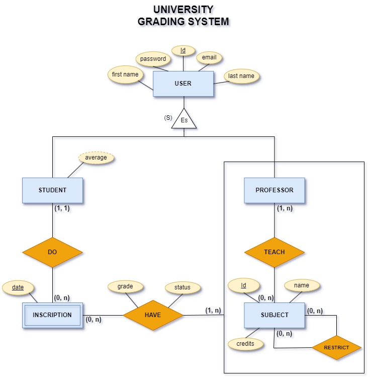

# University Grading System

This repository contains the backend of the University Grading System project. The project is a web application that allows students to view their grades, professors to enter grades, and administrators to manage the system.

## Database structure

The following diagram represents the Entity Relationship Diagram (ERD) of the database:

    

### Entities

- **User**: Represents any person of the system that is interested in using the system.
- **Student**: Represents a user of the system that is interested in take subjects and view grades.
- **Professor**: Represents a user of the system that is interested in teaching subjects and grading students.
- **Inscription**: Refers to the action of a student to enroll in one or more subjects.
- **Subject**: Represents a course that is taught by a professor and taken by students.

### Relationships

- **Specialization**: All users has the same attributes, but they have different behaviors with subjects and grades.
- **Do**: One to many relationship. A student can do many inscriptions and an inscription is done by one student.
- **Teach**: Many to many relationship. A professor can teach many subjects and a subject can be taught by many professors.
- **Restrict**: Many to many relationship. A subject can be restricted by many other subjects and a subject can restrict many other subjects.
- **Have** Many to many relationship. A inscription can have many subjects and a subject can be had by many inscriptions.

### Attributes

- **User**:

  - `id`: Simple, single-valued attribute that is used like unique identifier of the user.
  - `email`: Simple, single-valued attribute that stores the email of the user.
  - `password`: Simple, single-valued attribute that stores the password of the user.
  - `first_name`: Simple, single-valued attribute that stores the first name of the user.
  - `last_name`: Simple, single-valued attribute that stores the last name of the user.

- **Inscription**:

  - `date`: Simple, single-valued attribute that stores the date of the inscription.

- **Subject**:
  - `id`: Simple, single-valued attribute that is used like unique identifier of the subject.
  - `name`: Simple, single-valued attribute that stores the name of the subject.
  - `credits`: Simple, single-valued attribute that stores the credits of the subject.

## Run the project

After cloning the project, follow the steps below to run the project:

### Add .env file

The .env file contains data that should not be pushed to the remote repository, if you are cloning and running this project use the `.env.example` file as a reference to build your .env file with all required data.

- Create a copy of the `.env.example` file, name it `.env`, and fill the missing information.

### Choose a database

Follow one of the following steps to choose a database: 1. Use a lightweight SQLite database by setting `DATABASE_TYPE=sqlite` in the `.env` file. 2. Create a local PostgreSQL database and add the credentials to the `.env` file (recommended for production). Don't forget to set `DATABASE_TYPE=postgres` in the `.env` file.

### Create a new python 3.10 environment

Use conda to create a new `python 3.10` environment. Run `conda create -n myenv python=3.10` to create a new environment.

### Install the `requirements.txt`

Run `pip install -r requirements.txt` to install the requirements

### Initialize database

To initialize the database:

- Run `python manage.py migrate`
- Run `python manage.py makemigrations`

### Create Super_user

Before you can enter the admin interface for the first time, you must:

- Run `python manage.py createsuperuser`
- Enter Email `Email address: admin@example.com`
- Enter password `Password: ********** Password`
- Enter password again `Password (again): *********`
- You will see the message `Superuser created successfully.`

### Using local machine

- Run `python manage.py runserver` to start the server.
- To access the admin interface, go to `http://localhost:8000/admin/`

### Swagger

Swagger is an open-source software framework backed by a large ecosystem of tools that helps developers design, build, document, and consume RESTful web services. Swagger is used in this project to document the API endpoints and provide a convenient way for developers to test the API endpoints. Swagger provides a web interface that allows developers to view the API endpoints and test them by sending requests and viewing the responses.

To access the swagger documentation, you must run the project locally and go to the following url: http://localhost:8000/swagger/
